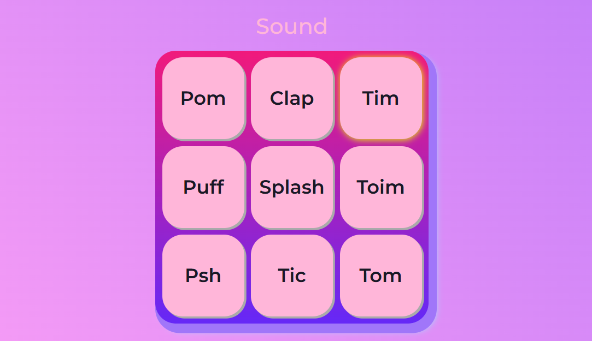

# Sound

Projeto interativo, testando vários tipos de sons. 

## 🔨 Funcionalidades do projeto

O objetivo deste projeto é o aperfeiçoamento em HTML e CSS, mas principalmente em algumas funções de Javasript. 

## ✔️ Técnicas e tecnologias utilizadas

-`HTML`
-`CSS`
-`Javascript`
-`Acessibilidade Web`

## 🛠️ Abrir e rodar o projeto

Para abrir e rodar o projeto, utilize um editor de código de sua escolha.
Depois, abra o projeto no seu navegador.

## VERCEL 
https://sound-seven.vercel.app/
